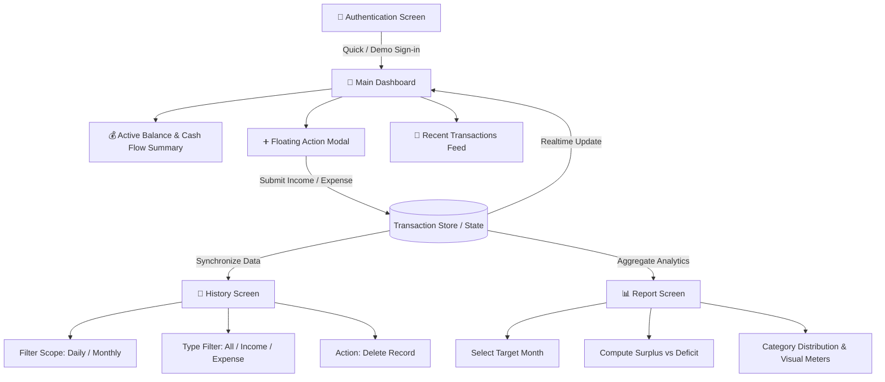

# 💎 CatatUang — Liquid Glass Finance App

<p align="center">
  
</p>

<p align="center">
  <b>A Modern Cash Flow & Expense Tracker with Liquid Glassmorphism Design</b><br>
  Powered by <b>React Native 0.86</b>, <b>React 19</b>, and <b>Expo SDK 57</b>.
</p>

<p align="center">
  
  
  
  
  
  
</p>

---

## 🌟 Overview

**CatatUang** is a personal finance and cash flow management mobile application built for speed, simplicity, and visual refinement. Featuring an ultra-modern **Liquid Glassmorphism** interface, fluid micro-interactions, native haptic feedback, and comprehensive financial analytics, it delivers an intuitive budgeting experience across mobile and web platforms.

---

## ✨ Key Features

| Feature | Description |
| :--- | :--- |
| 🪟 **Liquid Glassmorphism UI** | Multi-layered frosted glass aesthetic crafted with `expo-blur`, dynamic `expo-linear-gradient` accents, and ambient floating orbs. |
| ⚡ **Realtime Balance Tracking** | Instant calculation of active balance, total income, total expenses, and net surplus/deficit. |
| ➕ **Quick Transaction Entry** | Modal-based quick capture for income and expense records with category presets and numeric validation. |
| 📜 **Granular History Filtering** | Filter transaction history by scope (**Daily** or **Monthly**) and by transaction type (**All**, **Income**, or **Expense**). |
| 📊 **Financial Analytics & Breakdown** | Comprehensive monthly reports with visual category distribution progress bars and percentage metrics. |
| 🌓 **Adaptive Dual Theme** | Seamless **Dark Mode** and **Light Mode** support with high-contrast readability in any lighting environment. |
| 📳 **Haptic Feedback** | Native iOS and Android tactile responses powered by `expo-haptics` for tactile user confirmations. |
| 🔔 **Glass Toasts & Animated Loaders** | Custom glass notification overlays and synchronized liquid loading spinners. |

---

## 🧭 Application Architecture & Workflow



### 1. **Authentication Flow**
- Sleek glassmorphism login container with credential validation.
- One-tap **"⚡ Auto-fill Demo Account"** shortcut (`demo@keuangan.id` / `secret123`) for rapid testing.
- State-driven authentication transition with animated feedback toasts.

### 2. **Financial Dashboard**
- **Primary Balance Card**: Displays active balance, real-time status beacon, and summarized cash flow counters.
- **Quick Action Bar**: Dedicated shortcuts to log incoming or outgoing funds.
- **Recent Activities**: Chronological feed of the 5 most recent transactions.

### 3. **Transaction History**
- **Multi-dimensional Filtering**: Switch between **Day-by-Day** and **Month-by-Month** perspectives.
- **Type Filtering**: Instant segmented filter for `All`, `Income`, and `Expense` types.
- **Record Management**: One-tap record deletion with haptic confirmation.

### 4. **Monthly Reports & Analytics**
- Comprehensive overview of monthly savings rate and cash balance delta.
- **Category Breakdown Meter**: Ranked allocation breakdown showing category percentage and proportionate progress meters.

---

## 🛠️ Technology Stack

- **Core Framework**: [React Native 0.86](https://reactnative.dev/) & [React 19](https://react.dev/)
- **Platform & Tooling**: [Expo SDK 57](https://expo.dev/)
- **Language**: [TypeScript 6](https://www.typescriptlang.org/)
- **UI & Graphics**:
  - `expo-blur` — Hardware-accelerated glassmorphism backdrop blur
  - `expo-linear-gradient` — Dynamic visual gradients
  - `expo-glass-effect` — Native glass surface shaders
  - `react-native-reanimated` — High-performance declarative animations
- **Interactivity & System Integration**:
  - `expo-haptics` — Native tactile feedback
  - `expo-status-bar` — Dynamic status bar controller

---

## 📂 Project Structure

```text
catat-uang/
├── assets/                  # Icons, splash screen, and adaptive graphical assets
│   ├── icon.png
│   ├── favicon.png
│   ├── splash-icon.png
│   └── android-icon-*.png
├── .claude/                 # Workspace and assistant configurations
├── App.tsx                  # Core application logic, screens, state, & styling
├── app.json                 # Expo configuration and application metadata
├── index.ts                 # Application runtime entrypoint
├── package.json             # Manifest, dependencies, and execution scripts
├── tsconfig.json            # TypeScript compiler configuration
├── AGENTS.md                # Agent runtime and environment architecture guide
└── README.md                # Primary project documentation
```

---

## 🚀 Getting Started

### Prerequisites
- [Node.js](https://nodejs.org/) (LTS version recommended)
- Package Manager: `npm`, `yarn`, `pnpm`, or `bun`
- [Expo Go](https://expo.dev/go) app installed on your physical device (iOS/Android) or configured Simulator/Emulator

### Installation & Run

1. **Clone the repository**:
   ```bash
   git clone https://github.com/anur/catat-uang.git
   cd catat-uang
   ```

2. **Install project dependencies**:
   ```bash
   npm install
   ```

3. **Start the development server**:
   ```bash
   npx expo start
   ```

4. **Launch the application**:
   - **Android**: Press `a` in the terminal or scan the QR code via Expo Go.
   - **iOS**: Press `i` in the terminal (macOS + Xcode required) or scan the QR code via Camera/Expo Go.
   - **Web**: Press `w` to run in a web browser.

---

## 🧪 Quality & Type Checking

Ensure type safety before committing changes:

```bash
npx tsc --noEmit
```

---

## 📄 License

This project is licensed under the **MIT License**. See the [LICENSE](LICENSE) file for complete details.

---

<p align="center">
  Crafted with precision for elegant and effortless personal wealth tracking.
</p>
