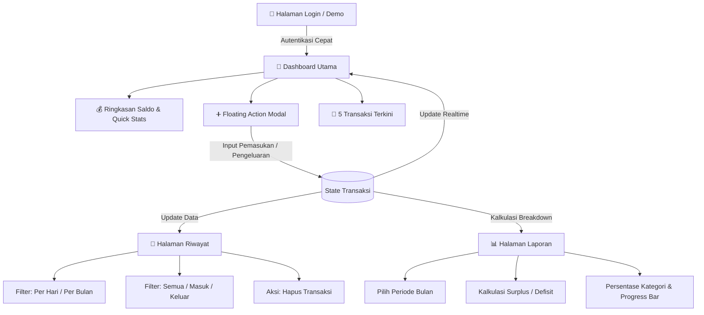

# 💎 CatatUang — Liquid Glass Finance App

<p align="center">
  
</p>

<p align="center">
  <b>Aplikasi Pencatat Keuangan Modern dengan Desain Liquid Glassmorphism</b><br>
  Ditenagai oleh <b>React Native 0.86</b>, <b>React 19</b>, dan <b>Expo SDK 57</b>.
</p>

<p align="center">
  
  
  
  
  
  
</p>

---

## 🌟 Tentang Proyek

**CatatUang** adalah aplikasi pencatatan arus kas (pemasukan dan pengeluaran) pribadi yang mengutamakan estetika visual tingkat tinggi dengan antarmuka **Liquid Glassmorphism**, transisi halus, haptic feedback, serta pelaporan keuangan yang interaktif dan komprehensif.

Aplikasi dirancang responsif dan fleksibel dengan dukungan penuh **Dark Mode & Light Mode** otomatis sesuai preferensi pengguna.

---

## ✨ Fitur Utama

| Fitur | Deskripsi |
| :--- | :--- |
| 🪟 **Liquid Glassmorphism UI** | Desain frosted glass berlapis dengan `expo-blur`, gradasi dinamis `expo-linear-gradient`, serta efek floating orbs beranimasi. |
| ⚡ **Live Realtime Balance** | Kalkulasi saldo instan dan otomatis menghitung total pemasukan, pengeluaran, serta net surplus/defisit. |
| ➕ **Pencatatan Cepat (Quick Add)** | Modal form pencatatan pemasukan/pengeluaran interaktif lengkap dengan kategori preset dan validasi nominal. |
| 📜 **Filter Riwayat Fleksibel** | Telusuri riwayat transaksi berdasarkan scope **Per Hari** atau **Per Bulan**, dengan filter tipe (Semua / Masuk / Keluar). |
| 📊 **Laporan & Rincian Kategori** | Visualisasi alokasi pengeluaran dan pemasukan per kategori menggunakan persentase & visual bar meter. |
| 🌓 **Dual Theme (Dark & Light)** | Transisi tema instan yang adaptif dengan kenyamanan visual di berbagai kondisi pencahayaan. |
| 📳 **Haptic Feedback** | Respon getar sentuhan native iOS/Android via `expo-haptics` untuk interaksi yang memuaskan. |
| 🔔 **Glass Toast & Animated Loader** | Notifikasi status dan loader aksi kustom dengan animasi pulse & spin fluid. |

---

## 🧭 Alur & Flow Aplikasi



### 1. **Autentikasi & Onboarding**
- Halaman login bergaya glass card.
- Dilengkapi tombol shortcut **"⚡ Isi otomatis akun Demo"** (`demo@keuangan.id` / `secret123`).
- Simulasi validasi kredensial dan feedback status via Glass Toast.

### 2. **Dashboard Finansial**
- **Kartu Saldo Utama**: Menampilkan Total Saldo, Indikator Realtime, badge total uang masuk vs uang keluar.
- **Shortcut Navigasi & Quick Action**: Tombol cepat catat pemasukan (+) atau pengeluaran (-).
- **Recent Activities**: Menampilkan 5 transaksi paling mutakhir secara ringkas.

### 3. **Riwayat Transaksi (History)**
- **Scope Filter**: Pilihan penelusuran transaksi spesifik berdasarkan **Tanggal (Per Hari)** atau **Bulan (Per Bulan)**.
- **Type Filter**: Filter cepat `Semua`, `Masuk` (Income), atau `Keluar` (Expense).
- **Manajemen Data**: Opsi hapus transaksi langsung dari daftar riwayat dengan haptic feedback.

### 4. **Laporan Bulanan (Report & Breakdown)**
- Ringkasan performa finansial bulanan (Surplus vs Defisit).
- **Category Breakdown Meter**: Menghitung porsi pengeluaran dan pemasukan per kategori beserta visualisasi *progress bar* persentase.

---

## 🛠️ Tech Stack & Dependensi

- **Core Framework**: [React Native 0.86](https://reactnative.dev/) & [React 19](https://react.dev/)
- **Application Platform**: [Expo SDK 57](https://expo.dev/)
- **Language**: [TypeScript 6](https://www.typescriptlang.org/)
- **Visual & UI**:
  - `expo-blur` — Frosted glassmorphism blur effect
  - `expo-linear-gradient` — Gradasi warna dinamis
  - `expo-glass-effect` — Enhancements efek kaca
  - `react-native-reanimated` — Animasi performa tinggi
- **Interactivity & UX**:
  - `expo-haptics` — Respon getar haptic native
  - `expo-status-bar` — Dynamic status bar themer

---

## 📂 Struktur Direktori

```text
catat-uang/
├── assets/                  # Aset icon, splash, dan gambar adaptif
│   ├── icon.png
│   ├── favicon.png
│   ├── splash-icon.png
│   └── android-icon-*.png
├── .claude/                 # Konfigurasi workspace
├── App.tsx                  # Core app logic, screen flows, state, & styling
├── app.json                 # Konfigurasi Expo & metadata aplikasi
├── index.ts                 # App entrypoint
├── package.json             # Dependensi dan script project
├── tsconfig.json            # Konfigurasi TypeScript
├── AGENTS.md                # Dokumentasi arsitektur runtime agent
└── README.md                # Dokumentasi utama proyek
```

---

## 🚀 Memulai (Quick Start)

### Prasyarat
- [Node.js](https://nodejs.org/) (versi LTS direkomendasikan)
- Package manager: `npm` atau `yarn` / `pnpm` / `bun`
- [Expo Go](https://expo.dev/go) di perangkat smartphone (iOS/Android) atau Simulator/Emulator

### Langkah Instalasi

1. **Clone repositori**:
   ```bash
   git clone https://github.com/anur/catat-uang.git
   cd catat-uang
   ```

2. **Instal dependensi**:
   ```bash
   npm install
   ```

3. **Jalankan server Expo**:
   ```bash
   npx expo start
   ```

4. **Buka aplikasi**:
   - **Android**: Tekan `a` pada terminal atau scan QR code melalui Expo Go.
   - **iOS**: Tekan `i` pada terminal (membutuhkan macOS + Xcode simulator) atau scan QR code via aplikasi Kamera/Expo Go.
   - **Web**: Tekan `w` untuk menjalankan di browser.

---

## 🧪 Validasi Tipe & Kode

Jalankan typecheck TypeScript sebelum commit:

```bash
npx tsc --noEmit
```

---

## 📄 Lisensi

Didistribusikan di bawah lisensi **MIT**. Lihat berkas [LICENSE](LICENSE) untuk informasi lebih lanjut.

---

<p align="center">
  Dibuat dengan ❤️ untuk pengelolaan keuangan yang lebih rapi dan elegan.
</p>
